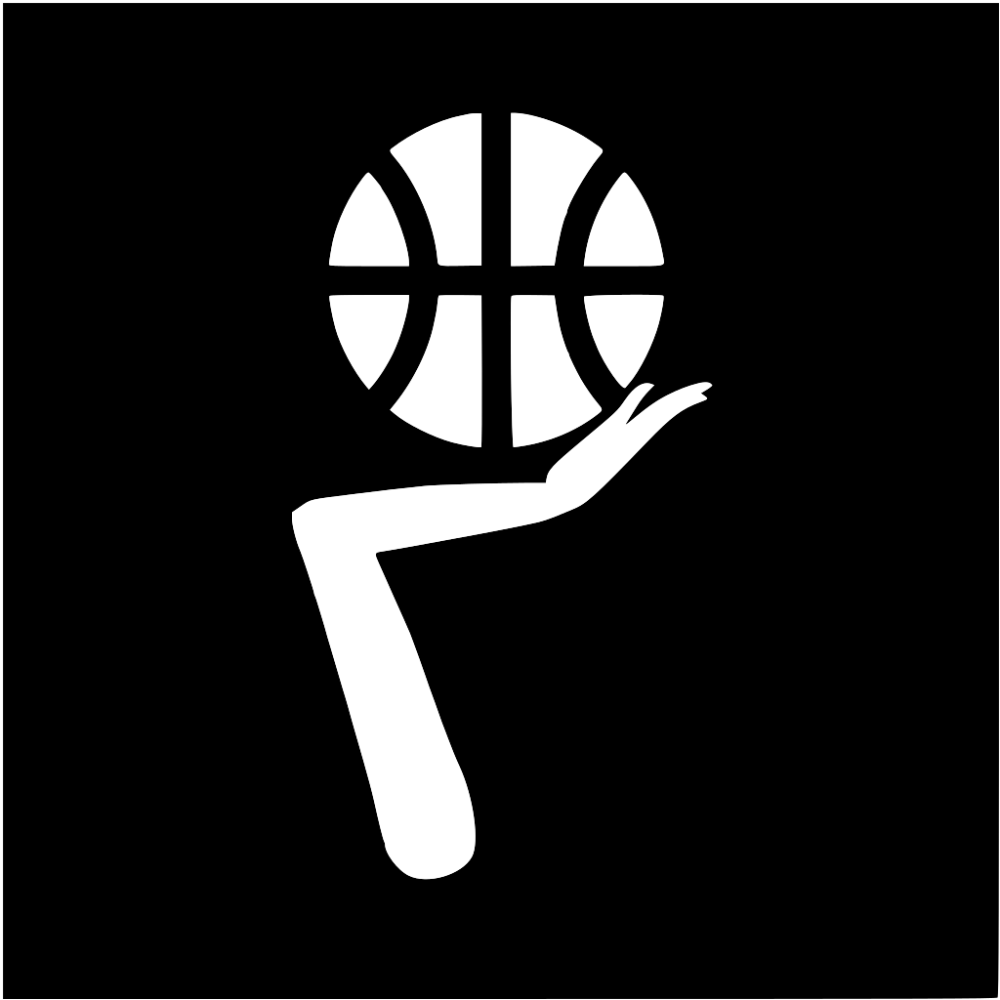

<!-- PROJECT SHIELDS -->
<!--
*** I'm using markdown "reference style" links for readability.
*** Reference links are enclosed in brackets [ ] instead of parentheses ( ).
*** See the bottom of this document for the declaration of the reference variables
*** for contributors-url, forks-url, etc. This is an optional, concise syntax you may use.
*** https://www.markdownguide.org/basic-syntax/#reference-style-links
-->
[![Contributors][contributors-shield]][contributors-url]
[![Forks][forks-shield]][forks-url]
[![Stargazers][stars-shield]][stars-url]
[![Issues][issues-shield]][issues-url]
[![License][license-shield]][license-url]
[![LinkedIn][linkedin-shield]][linkedin-url]

<!-- PROJECT LOGO -->
 

  

<h3 align="center">Pull Up Bball</h3>

  

    Live NBA Game updates
     
    <a href="https://github.com/arvinshen/Pull-Up-Bball-App"><strong>Explore the docs »</strong></a>
     
     
    <a href="https://github.com/arvinshen/Pull-Up-Bball-App">Download on the App Store</a>
    ·
    <a href="https://github.com/arvinshen/Pull-Up-Bball-App/issues">Report Bug</a>
    ·
    <a href="https://github.com/arvinshen/Pull-Up-Bball-App/issues">Request Feature</a>
  

<!-- TABLE OF CONTENTS -->

  
Table of Contents

  <ol>
    <li>
      <a href="#about-the-project">About The Project</a>
      <ul>
        <li><a href="#features">Features</a></li>
      </ul>
    </li>
    <li>
      <a href="#getting-started">Getting Started</a>
      <ul>
        <li><a href="#prerequisites">Prerequisites</a></li>
        <li><a href="#installation">Installation</a></li>
      </ul>
    </li>
    <li><a href="#usage">Usage</a></li>
    <li><a href="#roadmap">Roadmap</a></li>
    <li><a href="#Privacy Policy">Privacy Policy</a></li>
    <li><a href="#contact">Contact</a></li>
  </ol>

<!-- ABOUT THE PROJECT -->
## About The Project

Pull Up Bball is a fast and minimalistic way to enjoy live NBA game updates that allows basketball enthusiasts to check games without spoilers.

### Features

- Daily Scores
    - Spoiler-free Setting
    - Shows National, Home, and Away Team Broadcasts
- Dark Mode
- Favorite Team Selection
- Favorite Team Game Start Notifications

(<a href="#top">back to top</a>)

<!-- GETTING STARTED -->
## Getting Started

### Prerequisites

Any iPhone/iPad with iOS 14.0 or later.

### Installation

Pull Up Bball publishing date TBD.
1. Visit the Apple [App Store](https://apple.com/app-store/) or the native App Store on your iPhone/iPad.
2. Search for 'Pull Up Bball'.
3. Tap the 'Get' button to install.
4. Open 'Pull Up Bball' and enjoy.

(<a href="#top">back to top</a>)

<!-- USAGE EXAMPLES -->
## Usage
![Live Daily Scores][iphone-screenshot1]
![Live Daily Scores][ipad-screenshot1]
![Spoiler-free Setting][iphone-screenshot2]
![Spoiler-free Setting][ipad-screenshot2]
![Simple Adjustable Settings][iphone-screenshot3]
![Simple Adjustable Settings][ipad-screenshot3]
![Highlights Games of Your Favorite Team][iphone-screenshot4]
![Highlights Games of Your Favorite Team][ipad-screenshot4]
![Native Dark Mode][iphone-screenshot5]
![Native Dark Mode][ipad-screenshot5]

(<a href="#top">back to top</a>)

<!-- ROADMAP -->
## Roadmap

- Additional Notification Options
    - 10 minutes before game time
    - Close game
    - Final score
- Standings
- Boxscores
    - Match-up Summary
    - Play-by-Play

See the [open issues](https://github.com/arvinshen/Pull-Up-Bball-App/issues) for a full list of proposed features (and known issues).

(<a href="#top">back to top</a>)

<!-- Privacy Policy -->
## Privacy Policy
#### Data Not Collected
The developer does not collect any data from the app.

For more information, see the [developer's privacy policy][privacy-url].

(<a href="#top">back to top</a>)

<!-- CONTACT -->
## Contact

Project Home Page: [https://arvinshen/github.io/Pull-Up-Bball-App](https://arvinshen/github.io/Pull-Up-Bball-App)

(<a href="#top">back to top</a>)

<!-- MARKDOWN LINKS & IMAGES -->
<!-- https://www.markdownguide.org/basic-syntax/#reference-style-links -->
[contributors-shield]: https://img.shields.io/github/contributors/arvinshen/Pull-Up-Bball-App.svg?style=for-the-badge
[contributors-url]: https://github.com/arvinshen/Pull-Up-Bball-App/graphs/contributors
[forks-shield]: https://img.shields.io/github/forks/arvinshen/Pull-Up-Bball-App.svg?style=for-the-badge
[forks-url]: https://github.com/arvinshen/Pull-Up-Bball-App/network/members
[stars-shield]: https://img.shields.io/github/stars/arvinshen/Pull-Up-Bball-App.svg?style=for-the-badge
[stars-url]: https://github.com/arvinshen/Pull-Up-Bball-App/stargazers
[issues-shield]: https://img.shields.io/github/issues/arvinshen/Pull-Up-Bball-App.svg?style=for-the-badge
[issues-url]: https://github.com/arvinshen/Pull-Up-Bball-App/issues
[license-shield]: https://img.shields.io/github/license/arvinshen/Pull-Up-Bball-App.svg?style=for-the-badge
[license-url]: https://github.com/arvinshen/Pull-Up-Bball-App/blob/main/LICENSE.txt
[linkedin-shield]: https://img.shields.io/badge/-LinkedIn-black.svg?style=for-the-badge&logo=linkedin&colorB=555
[linkedin-url]: https://linkedin.com/in/arvin-shen
[privacy-url]: https://arvinshen.github.io/Pull-Up-Bball-App/assets/sprivacy-policy.html
[iphone-recording1]: assets/Simulator-Screen-Recording-iPhone13-2022-02-05-at-18.40.29.gif
[iphone-recording2]: assets/Simulator-Screen-Recording-iPhone13-2022-02-05-at-18.46.19.gif
[iphone-recording3]: assets/Simulator-Screen-Recording-iPhone13-2022-02-05-at-19.33.34.gif
[iphone-screenshot1]: assets/iphone-image1.png
[iphone-screenshot2]: assets/iphone-image2.png
[iphone-screenshot3]: assets/iphone-image3.png
[iphone-screenshot4]: assets/iphone-image4.png
[iphone-screenshot5]: assets/iphone-image5.png
[ipad-screenshot1]: assets/ipad-image1.png
[ipad-screenshot2]: assets/ipad-image2.png
[ipad-screenshot3]: assets/ipad-image3.png
[ipad-screenshot4]: assets/ipad-image4.png
[ipad-screenshot5]: assets/ipad-image5.png
