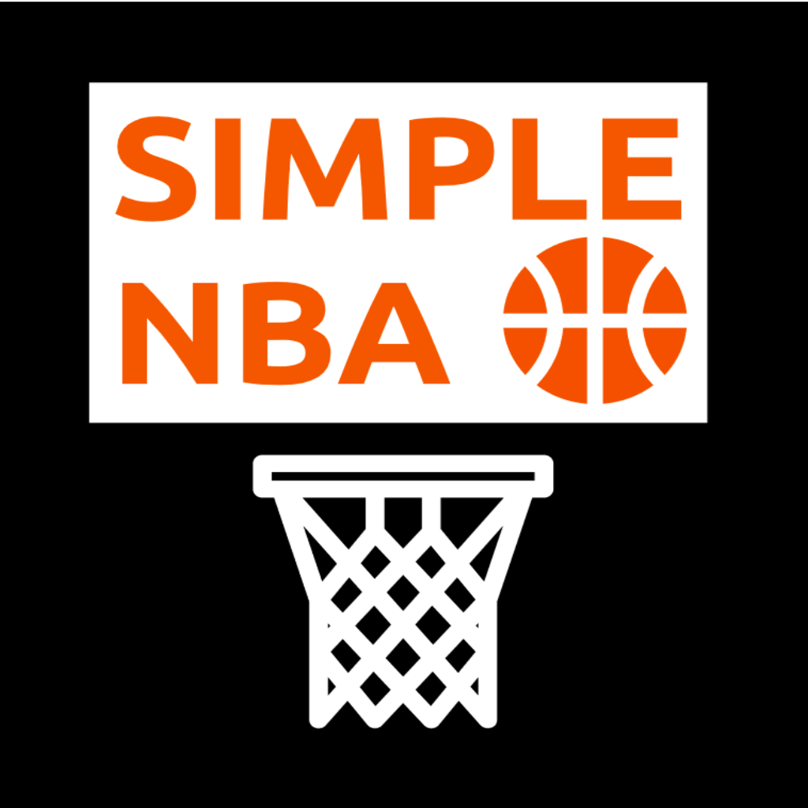

<!-- PROJECT SHIELDS -->
<!--
*** I'm using markdown "reference style" links for readability.
*** Reference links are enclosed in brackets [ ] instead of parentheses ( ).
*** See the bottom of this document for the declaration of the reference variables
*** for contributors-url, forks-url, etc. This is an optional, concise syntax you may use.
*** https://www.markdownguide.org/basic-syntax/#reference-style-links
-->
[![Contributors][contributors-shield]][contributors-url]
[![Forks][forks-shield]][forks-url]
[![Stargazers][stars-shield]][stars-url]
[![Issues][issues-shield]][issues-url]
[![LinkedIn][linkedin-shield]][linkedin-url]

<!-- PROJECT LOGO -->
 

  

<h3 align="center">Simple NBA</h3>

  

    project_description
     
    <a href="https://github.com/arvinshen/Simple-NBA-App"><strong>Explore the docs »</strong></a>
     
     
    <a href="https://github.com/arvinshen/Simple-NBA-App">View Demo</a>
    ·
    <a href="https://github.com/arvinshen/Simple-NBA-App/issues">Report Bug</a>
    ·
    <a href="https://github.com/arvinshen/Simple-NBA-App/issues">Request Feature</a>
  

<!-- TABLE OF CONTENTS -->

  
Table of Contents

  <ol>
    <li>
      <a href="#about-the-project">About The Project</a>
      <ul>
        <li><a href="#built-with">Built With</a></li>
      </ul>
    </li>
    <li>
      <a href="#getting-started">Getting Started</a>
      <ul>
        <li><a href="#prerequisites">Prerequisites</a></li>
        <li><a href="#installation">Installation</a></li>
      </ul>
    </li>
    <li><a href="#usage">Usage</a></li>
    <li><a href="#roadmap">Roadmap</a></li>
    <li><a href="#contributing">Contributing</a></li>
    <li><a href="#Privacy Policy">Privacy Policy</a></li>
    <li><a href="#contact">Contact</a></li>
    <li><a href="#acknowledgments">Acknowledgments</a></li>
  </ol>

<!-- ABOUT THE PROJECT -->
## About The Project

Here's a blank template to get started: To avoid retyping too much info. Do a search and replace with your text editor for the following: `arvinshen`, `Simple-NBA-App`, `twitter_handle`, `arvin-shen`, `email`, `email_client`, `Simple NBA`, `project_description`

(<a href="#top">back to top</a>)

<!-- GETTING STARTED -->
## Getting Started

### Prerequisites

Any iPhone/iPad with iOS 14.0 or later.

### Installation

1. Visit the Apple [App Store](https://apple.com/app-store/) or the native App Store on your iPhone/iPad.
2. Search for 'Simple NBA'.
3. Tap the 'Get' button to install.
4. Open 'Simple NBA' and enjoy.

(<a href="#top">back to top</a>)

<!-- USAGE EXAMPLES -->
## Usage
![Live Daily Scores][iphone13-screenshot1]

(<a href="#top">back to top</a>)

<!-- ROADMAP -->
## Roadmap

- Additional Notification Options
    - 10 minutes before game time
    - Close game
    - Final score
- Standings
- Boxscores
    - Match-up Summary
    - Play-by-Play

See the [open issues](https://github.com/arvinshen/Simple-NBA-App/issues) for a full list of proposed features (and known issues).

(<a href="#top">back to top</a>)

<!-- Privacy Policy -->
## Privacy Policy

(<a href="#top">back to top</a>)

<!-- CONTACT -->
## Contact

Project Link: [https://github.com/arvinshen/Simple-NBA-App](https://github.com/arvinshen/Simple-NBA-App)

(<a href="#top">back to top</a>)

<!-- MARKDOWN LINKS & IMAGES -->
<!-- https://www.markdownguide.org/basic-syntax/#reference-style-links -->
[contributors-shield]: https://img.shields.io/github/contributors/arvinshen/Simple-NBA-App.svg?style=for-the-badge
[contributors-url]: https://github.com/arvinshen/Simple-NBA-App/graphs/contributors
[forks-shield]: https://img.shields.io/github/forks/arvinshen/Simple-NBA-App.svg?style=for-the-badge
[forks-url]: https://github.com/arvinshen/Simple-NBA-App/network/members
[stars-shield]: https://img.shields.io/github/stars/arvinshen/Simple-NBA-App.svg?style=for-the-badge
[stars-url]: https://github.com/arvinshen/Simple-NBA-App/stargazers
[issues-shield]: https://img.shields.io/github/issues/arvinshen/Simple-NBA-App.svg?style=for-the-badge
[issues-url]: https://github.com/arvinshen/Simple-NBA-App/issues
[privacy-url]: https://github.com/arvinshen/Simple-NBA-App/blob/main/simple-nba-privacy-policy.html
[linkedin-shield]: https://img.shields.io/badge/-LinkedIn-black.svg?style=for-the-badge&logo=linkedin&colorB=555
[linkedin-url]: https://linkedin.com/in/arvin-shen
[iphone13-recording1]: assets/Simulator-Screen-Recording-iPhone13-2022-02-05-at-18.40.29.gif
[iphone13-recording2]: assets/Simulator-Screen-Recording-iPhone13-2022-02-05-at-18.46.19.gif
[iphone13-recording3]: assets/Simulator-Screen-Recording-iPhone13-2022-02-05-at-19.33.34.gif
[iphone13-screenshot1]: assets/Simulator-Screen-Shot-iPhone13-2022-02-05-at-12.30.37.png
[iphone13-screenshot2]: assets/Simulator-Screen-Shot-iPhone13-2022-02-05-at-12.35.32.png
[iphone13-screenshot3]: assets/Simulator-Screen-Shot-iPhone13-2022-02-05-at-17.41.58.png
[iphone13-screenshot4]: assets/Simulator-Screen-Shot-iPhone13-2022-02-05-at-17.42.11.png
[iphone13-screenshot5]: assets/Simulator-Screen-Shot-iPhone13-2022-02-05-at-17.43.55.png
[iphone13-screenshot6]: assets/Simulator-Screen-Shot-iPhone13-2022-02-05-at-17.30.06.png
